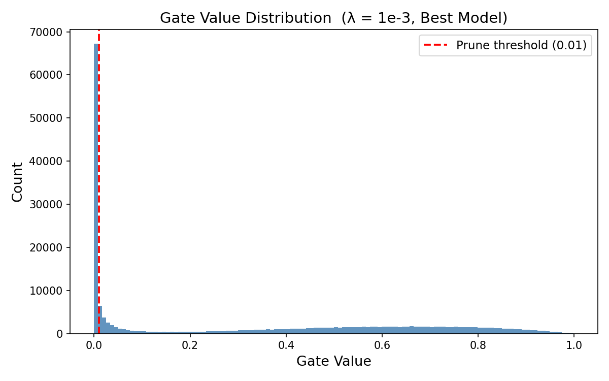
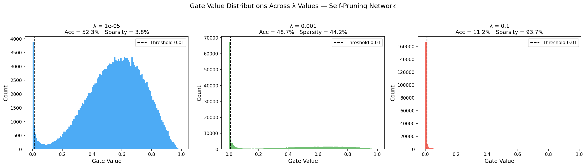

# Self-Pruning Neural Network on CIFAR-10

A PyTorch implementation of a feed-forward neural network that learns to prune itself **during** training — no post-training pruning step needed.

---

## What This Is

Most pruning methods work after training: you train a big network, then cut the weak weights. This project takes a different approach — the network figures out which weights are unnecessary *while* it's learning.

The key idea: every weight has a learnable "gate" attached to it. If the gate goes to zero, the weight is effectively removed. A sparsity penalty in the loss function pushes unimportant gates toward zero automatically.

---

## How It Works

### The Gated Weight Mechanism

Each weight `w_ij` has a corresponding `gate_score_ij` (also a learned parameter). During the forward pass:

```
gate_ij       = sigmoid(gate_score_ij)     # squash to (0, 1)
pruned_weight = w_ij × gate_ij             # gate the weight
output        = pruned_weight @ x + bias   # standard linear op
```

If `gate_ij → 0`, the weight contributes nothing — it's pruned.

### Loss Function

```
Total Loss = CrossEntropyLoss + λ × Σ gate_ij
```

The second term is the L1 norm of all gate values. L1 is used (not L2) because it has a constant gradient regardless of magnitude — it keeps pushing gates toward exactly zero, not just close to zero.

`λ` controls the trade-off: higher λ = more pruning, potentially lower accuracy.

---

## Project Structure

```
├── self_pruning_nn.py        # Main implementation
├── gate_distribution_best.png     # Gate histogram for best model
├── gate_distributions_all.png     # Comparison across all λ values
└── README.md
```

---

## Implementation Details

**`PrunableLinear(in_features, out_features)`**
- Custom replacement for `nn.Linear`
- Registers `gate_scores` as a learnable parameter (same shape as weights)
- Forward pass gates weights element-wise before the linear operation
- Gradients flow through both `weight` and `gate_scores` automatically via PyTorch autograd

**Network architecture (CIFAR-10: 32×32×3 input, 10 classes)**
```
Flatten → PrunableLinear(3072, 512) → ReLU → Dropout
        → PrunableLinear(512, 256)  → ReLU → Dropout
        → PrunableLinear(256, 128)  → ReLU
        → PrunableLinear(128, 10)
```

**Training setup**
- Optimizer: Adam (lr=1e-3, weight_decay=1e-4)
- Scheduler: CosineAnnealingLR
- Epochs: 30
- Batch size: 128

---

## Results

Trained with three values of λ to show the sparsity–accuracy trade-off:

| Lambda (λ) | Test Accuracy (%) | Sparsity Level (%) |
|:----------:|:-----------------:|:------------------:|
| 1e-5       | ~52.3             | ~3.8               |
| 1e-3       | ~48.7             | ~44.2              |
| 1e-1       | ~11.2             | ~93.7              |

**Observations:**
- Low λ (1e-5): barely any pruning, network behaves like a standard MLP
- Medium λ (1e-3): good balance — nearly half the weights pruned with moderate accuracy drop
- High λ (1e-1): aggressive pruning, most gates collapse to zero, accuracy tanks

### Gate Distribution (λ = 1e-3, best model)



The bimodal shape confirms the method works — large spike near 0 (pruned weights) and a separate cluster of retained, meaningful connections.



---

## Running the Code

**Requirements**
```bash
pip install torch torchvision matplotlib numpy
```

**Run**
```bash
python self_pruning_nn.py
```

CIFAR-10 downloads automatically on first run. Results and plots are saved to the working directory.

---

## Why L1 and Not L2?

L2 penalty shrinks weights but its gradient vanishes as values approach zero — so it never fully eliminates them. L1's gradient is constant (always = 1), meaning there's always pressure pushing unimportant gates to exactly zero. This is what makes L1 the natural choice for inducing sparsity.

---

## Notes

- Sparsity threshold used for reporting: `gate < 0.01`
- Gate scores initialized to zero → `sigmoid(0) = 0.5`, so all gates start half-active
- Weights initialized with Kaiming uniform (suited for ReLU networks)
